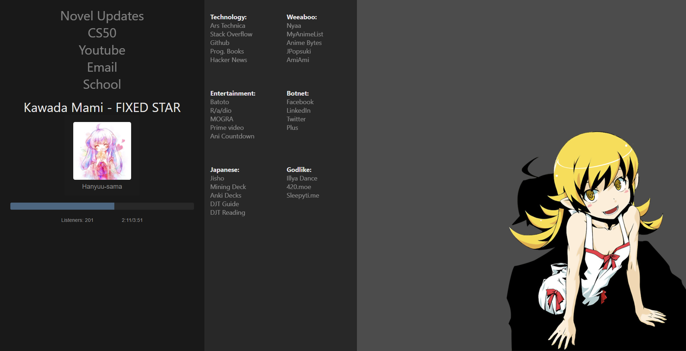
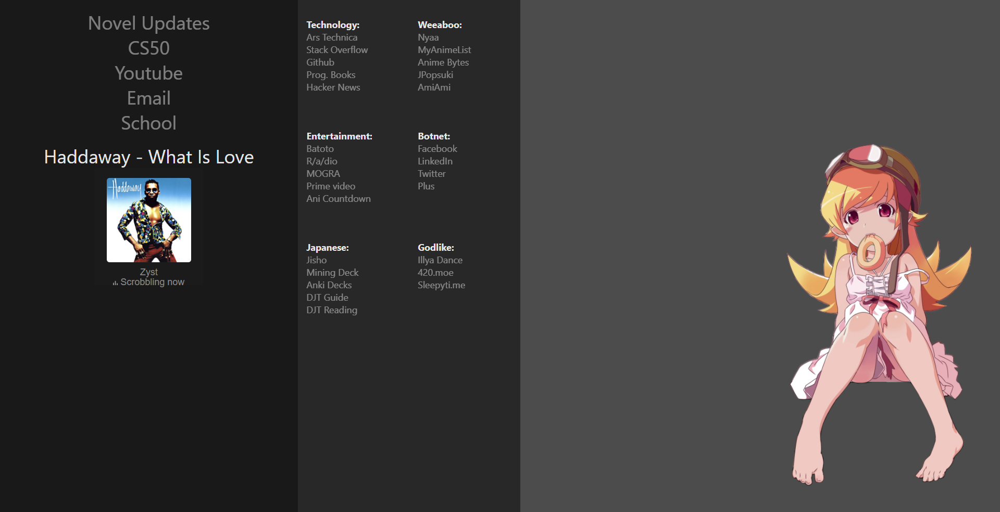
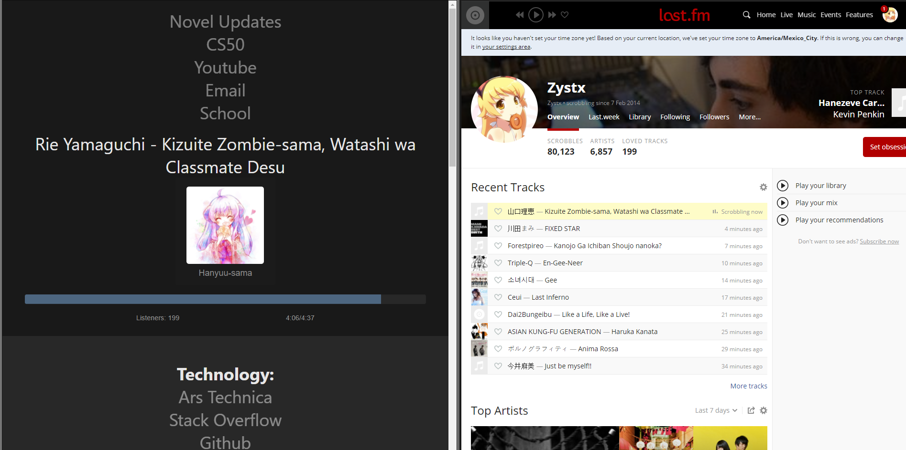

# My homepage

Loads r/a/dio currently playing information. As of 2.0 it also checks your
Last.fm profile.

It cycles backgrounds randomly on load using `randomBG()` in `app/app.js` from
the images numbered 1 - n in the `/images` folder.

Recently reformatted to use a service worker, which makes it work offline, and
load a bit faster. This is also all Vanilla JS now. I'm not running babel on it
though, so this will only work in browsers with ES6/Fetch support. I don't plan
to babelify it either.

Hosted on [shinobu.moe](shinobu.moe)

## Completed Goals:

* Base Site
* 404 Page
* PHP cURL script to obtain info from the r/a/dio api
* JS to display the aforementioned information
* Now Playing r/a/dio
* DJ Box with images r/a/dio
* Listener Count
* Starting time/Ending Time (Song)
* Make Starting time tick 'up' with JS
* Progress bar based on Starting time progress
* Auto-updates from API (Song Changes and time updates)
* Possibly a mobile/smaller resolution version.
* Last.fm support
* Add service worker. Works offline/all resources are cached
* Reformatted to VanillaJS

## Screenshots

### Normal r/a/dio

### Playing Last.fm auto grabs album art when available

### If you aren't playing anything on Last.fm it shows what's playing in r/a/dio

### If what you are scrobbling to Last.fm what is playing in r/a/dio you get the r/a/dio view instead of the Last.fm view

Distributed under the [MIT License](http://opensource.org/licenses/MIT) feel
free to use this code however you want.
